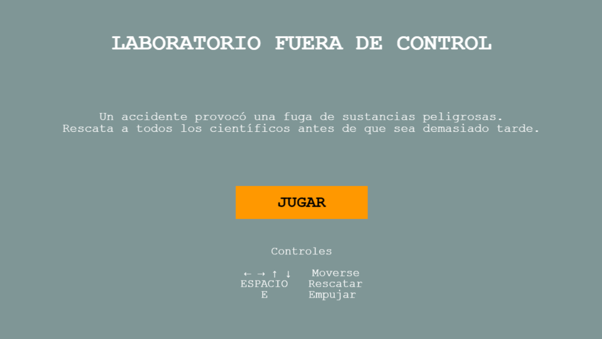
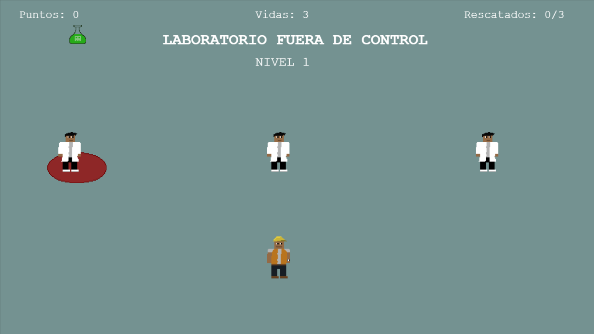
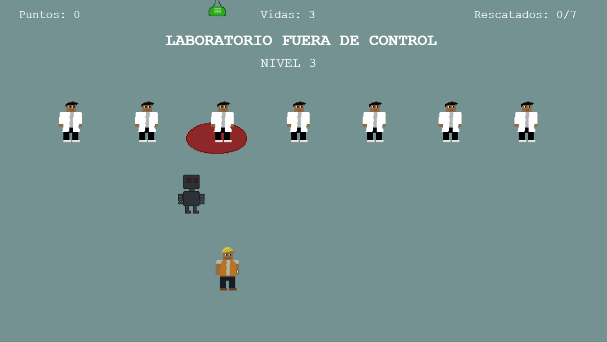
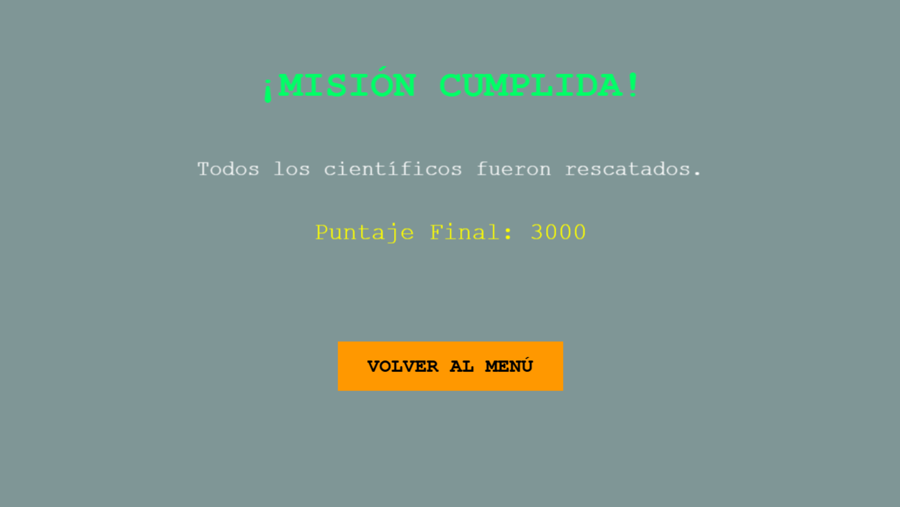

## 🧪 Laboratorio Fuera de Control

Proyecto desarrollado en **JavaScript** utilizando **Phaser 3**.

## 📖 Descripción

En un laboratorio ocurrió un accidente que provocó la caída de sustancias peligrosas. El jugador deberá rescatar a todos los científicos antes de que sean alcanzados por los objetos contaminantes.

Cada nivel aumenta la dificultad incorporando nuevos obstáculos y una mayor cantidad de científicos por rescatar.

---

## 🎯 Objetivo

Rescatar a todos los científicos del laboratorio evitando que sean alcanzados por los objetos peligrosos.

Si el jugador pierde todas sus vidas, la partida termina.

---

## Concepto: "Está mal, pero no tan mal"

El concepto "Está mal, pero no tan mal" se representa mediante la mecánica principal del juego. Los científicos pueden encontrarse en una situación de peligro, pero todavía es posible salvarlos antes de que ocurra un accidente.

Aunque el laboratorio se encuentra en una situación crítica y los accidentes son inevitables, el jugador puede minimizar las consecuencias actuando rápidamente para rescatar a la mayor cantidad posible de científicos.

---

## 🕹️ Controles

| Tecla    | Acción              |
| -------- | ------------------- |
| ⬅️➡️⬆️⬇️ | Mover al personaje  |
| Espacio  | Rescatar científico |
| E        | Empujar objeto      |

---

## 🎮 Mecánicas

- Sistema de puntuación.
- Sistema de vidas.
- Tres niveles con dificultad progresiva.
- Científicos rescatables.
- Objetos que caen desde zonas de peligro.
- Robot enemigo en el último nivel.
- Pantalla de Victoria.
- Pantalla de Game Over.

---

## Niveles

## Nivel 1

Introduce las mecánicas principales del juego. El objetivo es rescatar **3 científicos**.

## Nivel 2

Aumenta la dificultad incrementando la cantidad de científicos a rescatar y la frecuencia de los accidentes. El objetivo es rescatar **5 científicos**.

## Nivel 3

Además del aumento de dificultad, aparece un robot que se desplaza por el escenario dificultando el rescate de los científicos. El objetivo es rescatar **7 científicos**.

---

## Acciones que suman puntos

- Rescatar un científico: **+100 puntos**.
- Sacar un científico de una zona peligrosa: **+50 puntos**.

---

## Acciones que restan puntos

- Empujar un científico que ya estaba fuera de peligro: **-50 puntos**.
- Que un científico sea alcanzado por un objeto peligroso: **-100 puntos**.

---

## Elementos que restan vidas

Cuando un objeto peligroso cae sobre una zona donde todavía permanece un científico, el jugador pierde:

- **1 vida**
- **100 puntos**

Cuando el robot el nivel 3 toca al jugador: **-1vida**

---

## Funcionamiento de los NPCs

Los NPCs representan científicos que esperan ser rescatados.

Su comportamiento es el siguiente:

- Permanecen inmóviles.
- Si están dentro de una zona peligrosa, primero deben ser empujados fuera de ella.
- Una vez seguros, pueden ser rescatados con la barra espaciadora.
- Si un objeto peligroso cae mientras permanecen en una zona de peligro, el jugador pierde una vida y puntos.

---

## Funcionamiento del NPC del último nivel

En el tercer nivel aparece un robot que se desplaza automáticamente por el escenario.

Su función es aumentar la dificultad obligando al jugador a prestar atención tanto al rescate de los científicos como a los movimientos del robot.

---

## 🛠️ Tecnologías utilizadas

- JavaScript
- Phaser 3
- HTML5
- CSS3
- Visual Studio Code
- Git
- GitHub

---

## 📂 Estructura del proyecto

laboratorio-fuera-de-control/
│
├── assets/
│ ├── player.png
│ ├── playerPush.png
│ ├── scientist.png
│ ├── robot.png
│ ├── object.png
│ ├── danger.png
│ └── floor.png
│
├── src/
│ ├── managers/
│ ├── prefabs/
│ ├── scenes/
│ ├── config.js
│ └── main.js
│
├── index.html
└── README.md

---

## Link al juego

https://valentinobatiston.github.io/laboratorio-fuera-de-control/

---

## Ejecutar el juego localmente

1. Clonar el repositorio:

git clone https://github.com/ValentinoBatiston/laboratorio-fuera-de-control

2. Ingresar al proyecto.

3. Abrir el proyecto con Visual Studio Code.

4. Instalar la extensión **Live Server** (si aún no está instalada).

5. Abrir el archivo `index.html`.

6. Ejecutar **Open with Live Server**.

## 📷 Capturas del juego

Menú principal

Nivel 1

Nivel 3

Pantalla de Victoria

## 📈 Desarrollo

El proyecto fue desarrollado de forma incremental.

Durante el desarrollo se implementaron las siguientes funcionalidades:

- Sistema de movimiento del jugador.
- Rescate de científicos.
- Eventos de peligro con objetos que caen.
- Sistema de puntuación.
- Sistema de vidas.
- Tres niveles con dificultad progresiva.
- Robot enemigo.
- Pantallas de menú, victoria y game over.
- Integración de assets gráficos.
- Adaptación de la interfaz a resolución HD.

## 👨‍💻 Autor

Valentino Batiston

Proyecto realizado para la materia de Desarrollo Tecnológico 2.
